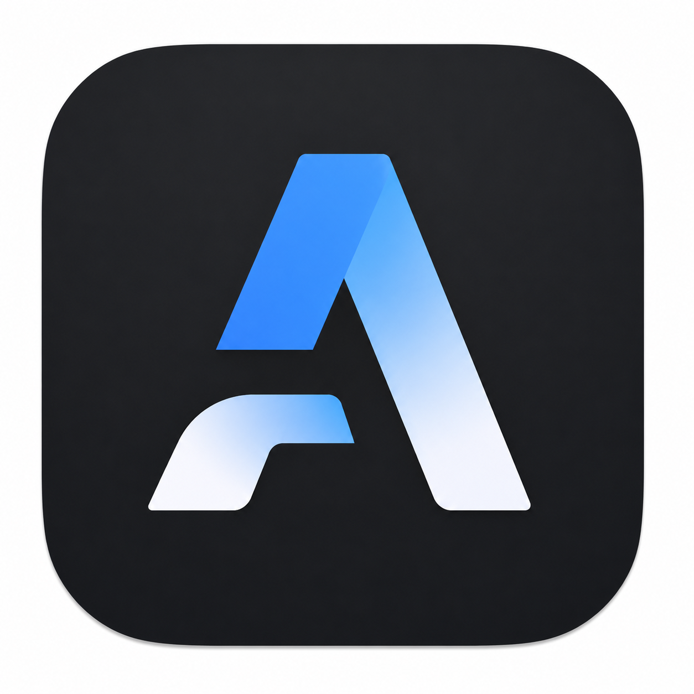
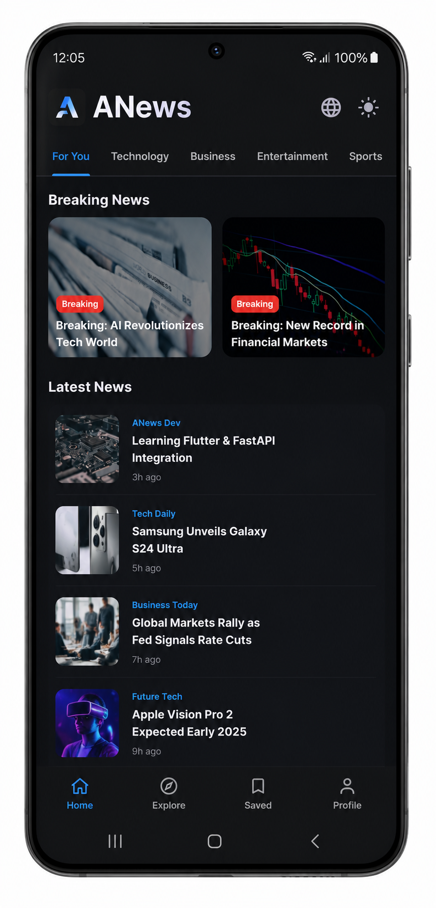
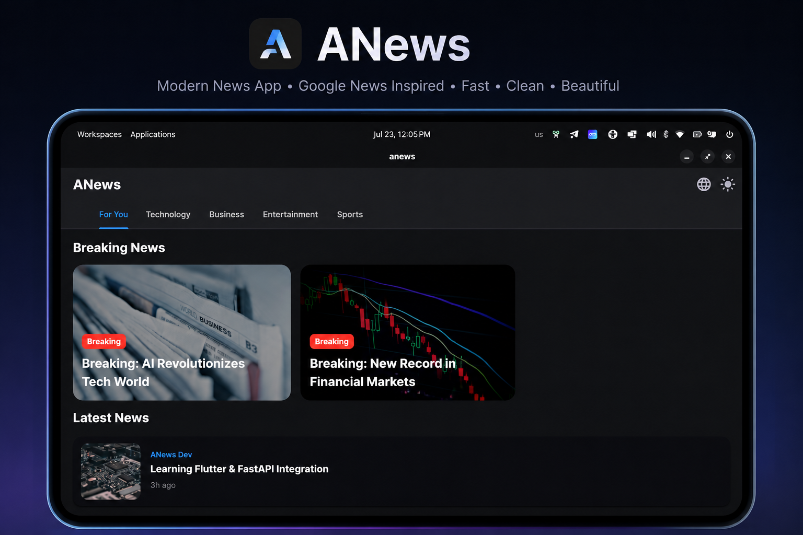

<h1 align="center">📰 ANews - Modern News App (Flutter & FastAPI)</h1>

   
  <b>A production-ready, full-stack news application with a Google News-inspired UI.</b>

---

<h2>📑 Table of Contents</h2>
<ul>
  <li><a href="#features">✨ Features</a></li>
  <li><a href="#tech-stack">🛠 Tech Stack</a></li>
  <li><a href="#prerequisites">📋 Prerequisites</a></li>
  <li><a href="#installation">🚀 Installation & Setup</a></li>
  <li><a href="#apk">📱 Building Android APK</a></li>
  <li><a href="#screenshots">📸 Screenshots</a></li>
</ul>

<h2 id="features">✨ Features</h2>
<ul>
  <li><b>Modern UI</b>: Material 3 design with Breaking News carousel and category tabs.</li>
  <li><b>Bilingual Support</b>: Instantly switch between English and Farsi (Full RTL support).</li>
  <li><b>Dark & Light Mode</b>: Seamless theme switching.</li>
  <li><b>FastAPI Backend</b>: High-performance asynchronous Python backend.</li>
  <li><b>Secure</b>: API keys are safely stored in <code>.env</code> and never exposed.</li>
  <li><b>Real-time Data</b>: Fetches real news using the Webz.io API.</li>
</ul>

<h2 id="tech-stack">🛠 Tech Stack</h2>
<ul>
  <li><b>Frontend</b>: Flutter, Dart, HTTP</li>
  <li><b>Backend</b>: Python, FastAPI, Uvicorn, HTTPX</li>
  <li><b>News Source</b>: Webz.io API</li>
</ul>

<h2 id="prerequisites">📋 Prerequisites</h2>

Before you begin, ensure you have the following installed:

<ul>
  <li><a href="https://www.python.org/downloads/">Python 3.8+</a></li>
  <li><a href="https://docs.flutter.dev/get-started/install">Flutter SDK</a></li>
  <li><a href="https://git-scm.com/downloads">Git</a></li>
</ul>

<h2 id="installation">🚀 Installation & Setup (Step-by-Step)</h2>

<h3>Step 1: Get Your Free API Key</h3>

This project uses the Webz.io News API to fetch real-time news.

<ol>
  <li>Go to the official website: <a href="https://webz.io/products/news-api#lite">Webz.io News API Lite</a></li>
  <li>Click on <b>"Get Started Now"</b> or <b>"Sign Up"</b>.</li>
  <li>Fill out the registration form to create a free account.</li>
  <li>Once logged in, navigate to your dashboard or API keys section.</li>
  <li>Copy your <b>API Token</b> (it will look something like <code>f2afdd77-...</code>).</li>
</ol>

<h3>Step 2: Backend Setup (FastAPI)</h3>

Open your terminal and run the following commands:

<pre><code># 1. Navigate to the backend folder
cd backend

# 2. Create a virtual environment (Recommended)
python -m venv venv

# 3. Activate the virtual environment
# On macOS/Linux:
source venv/bin/activate
# On Windows:
venv\Scripts\activate

# 4. Install required packages
pip install -r requirements.txt

# 5. Configure your API key
cp .env.example .env
# Open the .env file and replace "your_api_key_here" with your actual Webz.io API key

# 6. Run the backend server
python main.py
</code></pre>

<i>Note: The server will start running on http://0.0.0.0:8000. Leave this terminal open.</i>

<h3>Step 3: Frontend Setup (Flutter)</h3>

Open a <b>new terminal window</b> (keep the backend running in the first one):

<pre><code># 1. Navigate to the frontend folder
cd anews

# 2. Install Flutter dependencies
flutter pub get

# 3. Configure IP Address
# Open lib/main.dart. Find the IP address (e.g., 10.0.2.2)
# If using an Android Emulator, use 10.0.2.2
# If using a physical device, use your computer's local IP address (e.g., 192.168.1.100)

# 4. Run the application
flutter run
</code></pre>

<h2 id="apk">📱 Building the Android APK</h2>

To generate a release APK for Android devices:

<pre><code>cd anews
flutter build apk --release --split-per-abi
</code></pre>

The generated APK will be located at <code>anews/build/app/outputs/flutter-apk/app-arm64-v8a-release.apk</code>.

<h2 id="screenshots">📸 Screenshots</h2>
<table border="0" cellspacing="20" cellpadding="0" align="center">
  <tr>
    <td align="center">
       
      <b>Mobile App (Android/iOS)</b>
    </td>
    <td align="center">
       
      <b>Desktop App (Linux/Windows/macOS)</b>
    </td>
  </tr>
</table>

<h2>📄 License</h2>

This project is licensed under the MIT License.

